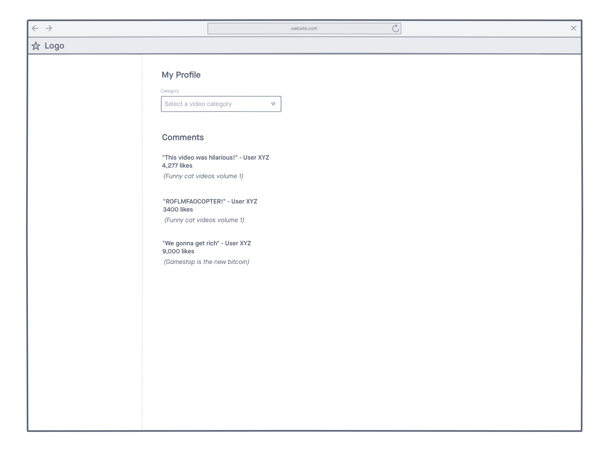

# Proposal

I want to build a website that will let users find the best comments on YouTube videos. These can be even more entertaining than the videos themselves.

The user should be able to choose a category of videos and see several comments that have been liked in the last 7 days. They can only see a few lines of each comment and expand if interested. The title of the comment should link directly to the YouTube video.

I will use the YouTube API to get comment content, comment likes, and the video URLs. I will use Flask to make the front-end.

# Mockup

